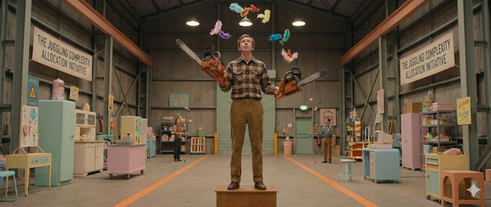

# Chainsaw Allocation and Software Complexity

## 1. Chainsaw Allocation

You inherited a chainsaw juggling company from your great uncle last week.

At least that's how the estate attorney described it.

At first, you were sure it was a misunderstanding. Then, you figured it had to be some elaborate joke. Eventually, the sheer peculiarity of it compelled you to see for yourself. So, you got in your car, plugged the address into Google Maps, and set off.

After a few hours, you turn onto a short gravel driveway that leads to a nondescript corrugated steel building in an industrial part of town. As you push through the main doors, an energetic middle-aged man walks briskly toward you, extending a firm handshake.

"The lawyer called and said you'd be by," he says, gesturing for you to follow. "You look just like your uncle, you know?"

You manage a polite smile and return his handshake, quickening your pace to match his. "I'm Frank Templeton, the GM. You've arrived at the perfect time. We're getting some new inventory today, and we're just about to allocate it."

"Inventory?" you ask, a hint of confusion in your voice.

Frank nodded. "Yep, five bricks. Average size. Should be interesting."

"Bricks? What do you need five bricks for?" you press, your eyebrows raising.

"Oh... for juggling. I thought the lawyer would have told you."

"Right. It's just... he made it sound like you guys only juggled chainsaws."

Frank laughs. "I guess that's what we're known for. And don't get me wrong, there ARE a lot of chainsaws. But our jugglers can and do handle almost anything."

You follow Frank to a set of double doors at the end of a long hallway.

"Here, you'll want to put these on," he says, plucking a pair of soundproof earmuffs from a rack by the door and handing them to you.

You have just enough time to put them on before the doors swing open and you're assaulted by the deafening wail of countless small engines running indoors. You walk into a cavernous warehouse, staring up at the immensity of the room. Suddenly, you bump into Frank's outstretched arm. He's pointing to a line of bright orange tape on the floor about 10 feet in front of you. As your eyes follow the tape, you see that it forms a large circle, apparently some sort of safety perimeter, around a 3' wooden podium, atop which is a thin man in a flannel shirt… juggling 2 chainsaws, a small potted plant, and a brass statue of a chihuahua.

*It's real. It's actually real.*

"Never cross the orange line," Frank shouts this time to be heard over the roar.

You nod your head.

As the shock wears off, you realize that there is row after row of jugglers. All arranged in a grid that covers most of the floor space of the warehouse. There must be over 100 of them.

Frank continues walking, leading you past the front row of jugglers to an office in the corner of the warehouse. He opens the door, ushering you in. As the door closes behind you, the cacophony of engines instantly stops, punctuated by the soft clanging of the blinds against the window.

Three people sit at a small table in the middle of the room, all staring up at you, apparently mid-conversation before the sudden rush of noise accompanied your entry. Frank introduces them as Jenkins, Rand, and Swarley—the project managers for the entire operation. All three are clearly distracted, hastily rising to shake your hand and exchange brief pleasantries before sitting back down to resume their work.

"This is an allocation meeting," Frank explains. "They're deciding whose team will take those new bricks."

Jenkins jumps in where he'd left off, with an exasperated huff: "Ok, so I guess we've ruled out Swarley's team. What about you, Rand? Your people must be able to take a brick or two."

"I've got a team that does nothing but beanie babies; no way I'm going to disrupt that," Rand replied. "I do have a few jugglers handling bowling pins and some ten-inch bar chainsaws. I think each could take a brick, but there might be better options..." Rand trails off, his eyes wandering to the wall, landing on a chart detailing all the juggling teams and their various inventory items.

You can’t contain yourself anymore. The combined bizarreness that has accumulated since you first heard about this place has finally reached a tipping point. You blurt out:

“Ok, just what directly the hell is going on here? Let’s set aside the issue of this being a tenable business model, which I’m convinced must be some version of a front. I’ll open that can of worms later. But how on Earth could you possibly pretend you’re making reasoned decisions about who should add bricks to their juggling routine?? This is madness!”

Frank smiles and leans back in his chair and puts his weathered grey sneakers on the table, saying: "Ok, sure, let's forget about the business model. The inventory allocation process is fascinating and basically a science. The whole prospect of juggling various objects is based on minimizing complexity. Each item has an inherent complexity, and when you combine different types—heavy with light, dangerous with safe—the total complexity isn't just additive, it multiplies. When any juggler's combined complexity exceeds their threshold, we get high drop rates and lost revenue."

Swarley picks up the explanation:

“Let’s say we get a shipment of chainsaws. These are going to have a different impact on every team. The addition of a chainsaw to one of Rand’s beanie baby jugglers, for instance, will cause a greater delta in our net complexity than it would if you were to give it to a juggler who’s already handling heavy or dangerous things. Juggling a mixture of heavy and light or soft and dangerous items is more complex for the juggler than simply sticking with things of the same type. Of course it depends on the skill level and strength of the juggler, but in general, it’s a good rule.”

Rand continues:

“The same change, introduced in two different places, may have a different effect on the net complexity. So we need to look at all of our options and determine which juggler is best able to take the new inventory with a minimal change to overall complexity of the system as a whole.”

"Our real goal is to minimize NJC: net juggled complexity." Frank says. The others all nod in agreement.

“Wouldn’t you just give all the heavy things to your biggest people? Why can’t everything just be based on strength?”

"Ah," Rand doesn't miss a beat. "Because it's not entirely within our control. Each juggler has one required item that they must juggle, as mandated by the 1995 Juggling Treaty of Regensberg. So we may get a 250lb power lifter whose required item is a tennis ball, and we just have to work with that. It's honestly why the whole thing comes down to complexity. If it were 100% within our control, strength and skill would indeed be the main factors."

"Speaking of tennis balls," Jenkins interjects, "Swarley, your tennis racket guy could take a brick, easy!"

The inventory allocation debate fires back up as you quietly rise from your chair and walk over to the window. You crack the blinds to peer out into the flurry of flying chaos that's beyond. Maybe not chaos… *complexity?*

## 2. Software Systems as Juggling
Software architecture, at its core, is a room full of jugglers.

Imagine your system: a mix of containerized APIs, a handful of serverless functions, a database or four. Each of these components represents a blend of inherent complexity—the irreducible nature of its function—and controlled complexity—the choices you make in its design and implementation. While we're thankfully not bound by the "1995 Juggling Treaty of Regensburg," the principle remains: some aspects of a component's complexity are simply beyond our direct influence.

It's common practice to think of feature additions or infrastructure changes in terms of "picking the right tool for the job." This mindset is crucial, but it overlooks a critical truth: we're always introducing complexity into an already complex system. And here's the kicker—this new complexity will have a vastly different impact on the net complexity of the system depending on where we choose to place it. Complexity isn't just a byproduct; it's a managed resource. Mismanaging it leads to cascading failures.

Let me give you an example.

I know someone who worked for a financial software company that made a terrible misjudgment when selecting and designing their primary database. The developers who built the MVP chose a key-value store, specifically DynamoDB. Their assumption was that access patterns would remain fixed and that the convenience of a managed service like DynamoDB outweighed the benefits of expressing relational data.

This decision, however, came at a significant cost. Many of the typical conveniences afforded by SQL, such as aggregate functions (e.g., count, average, sum), were unavailable to them. Slowly, little bits of complexity that should have been the domain of the DB query language crept out into the business logic and lived in the API.

So, instead of a simple database command to increment a value, developers first had to retrieve the record, increment the value in application code, and then store the updated number. Or, rather than querying for a count of matching records, they were forced to write code that would retrieve every matching record, iterate through them, maintain a running count in a state variable, and then return that sum.

*They gave the bricks to the person juggling ten tennis balls rather than the person juggling three bowling pins.*

This misplaced complexity had a ripple effect that dominated the codebase. Even the simplest feature addition became a nightmarish excursion into an abyssal hellscape.

In essence, they put the complexity in the wrong place.

They burdened the "beanie baby jugglers" with objects they weren't designed to handle, leading to an exponential increase in the overall system's fragility.

The juggling company metaphor is meant to illustrate that complexity isn't merely about individual components; it's profoundly about how those components interact within the whole system. A brick, in isolation, isn't inherently complex. But hand it to someone already juggling feathers, and you're going to have a very bad time.

When we design software systems, we obsess over picking the "right tool for the job." But we should be equally, if not more, obsessed with picking the right *place* for the complexity. That financial company didn't just choose the wrong database; they chose to scatter their inherent data complexity across every corner of their codebase instead of containing it where it belonged—within a system designed for such relationships.

The next time you're architecting a feature, adding a service, or refactoring a module, pause. Don't just ask "what's the best tool?" Ask "where does this complexity belong?" Ask "who's already juggling what?" Ask "am I about to hand bricks to the beanie baby juggler?"