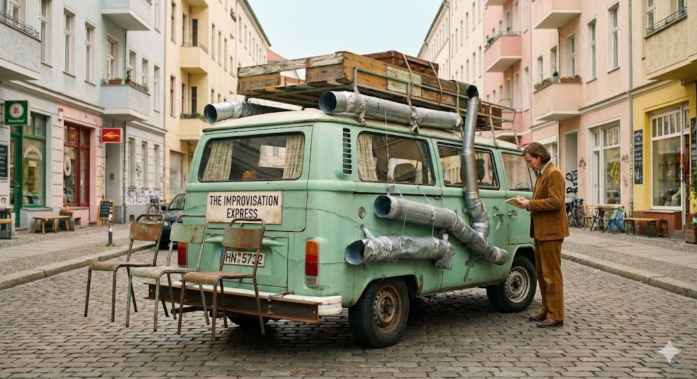

# The Road to Hell is Paved With MVPs

Imagine you want to start a transportation business. Maybe an airport shuttle service.

Of course, to start, you’re not flush with cash. So you find some investors. Your great Aunt Patsy and your old neighbor Thomas wind up investing a combined $7,000 with you.

Of course, they insist that you test out your idea and make sure there’s really a market appetite for a shuttle service before you start firing up the cash furnaces. 

So you start with an MVP. 

Something that is the bare minimum needed to test out your business model without being so crappy that no one will use it. 

Patsy and Thomas are all on board. They agree that it’s best not to blow all the cash before you’re sure you can make it back.

So you buy a 2013 Chrysler Town & Country. You find one for $3k at a local used car lot, put about $300 into a thorough wash & detail, and you’re off to the races airport with less than 50% of your initial investment burned.

And what do you know, it’s a success! Just two weeks later, your phone’s buzzing like the pager on an inner-city surgeon in the 8trrtyj0’s and your little Chrysler turned out to be a great investment. Its 5 (6 in a pinch) passenger seats are enough to satisfy your current demand and the money is coming in faster than it’s going out.

Eager to keep the ball of success rolling, you begin polling your passengers after every ride: 

“What could we do to make your trip more enjoyable?” 

You find that the top responses are:
- More cup holders for passengers in the back seat
- Automatic trunk release (so the passengers don’t need to wait for the driver to get out and show them how to pop the trunk)
- New upholstery (2013 was more than 10 years ago at this point and those cloth seats really tell a story at this point)

Great! You can satisfy all these requests for a pretty minimal cost. These requests aren’t significant enough that you need to worry about buying a newer / different car. You just need to hire someone to add a few features.

Enter Jerry the mechanic. 

Jerry is given a modest equity interest in the company as well as a slightly sub-market salary in exchange for his work maintaining and enhancing your fleet (so far just the Chrysler) as the needs of the company evolve during its rapid growth.

Jerry gets to work adding the requested features to the car. No problem with the upholstery and there’s a stock kit for upgrading the trunk release. But he does warn you that the cup holders are going to look a little… jerry rigged. There’s not really a good place to put them and they may look a bit out of place, but he thinks he can make it work; this is a startup after all and Jerry understands the need to be scrappy.

Now that the money’s flowing, Patsy and Thomas are putting some pressure on you to keep growing! Keep up the momentum!

More survey results come in. 

This time it’s complaints about the AC / heat. When passengers get into the car, they often open the large sliding door and the trunk at the same time, resulting in a current of outside air flowing through the car carrying away all of the hot / cold air. Clients indicate on the survey that they often don’t feel the temperature return to a normal level until they’re almost at the airport.

Turns out this model of Town & Country has a known design flaw. The air ducts are too narrow to carry the volume of air that’s needed to speedily adjust the temperature. This was a result of the size and configuration of other components, which limited the possible size of the ducts. 

“We don’t care how you do it, just figure out a way to make the cabin heat & cool faster.” You say.

Jerry protests “But… I can’t get bigger ducts between the trim and body panels. There simply isn’t space. The only way to do this is to either have exposed ducting in the car or to run the ducting on the outside of the car.”

—

This time it’s… capacity. Turns out there are lots of parties of 7 or 8 who had to split up because you couldn’t take all of them in one trip, and those left out wound up using your competitor. You’re leaving money on the table. 

If you could only add a few extra seats you could really increase revenue…

You approach Jerry. “What if we could add 2 seats in the rear?”

“In the TRUNK?!” Jerry says, in disbelief.

“I know it sounds crazy, but we can’t afford to buy a bigger car at this point. Patsy and Thomas would never approve that expense if we could get the same result from just a few hundred dollars in parts. I know you can do it, Jerry. Just make it happen. We’ll get a bigger car soon. Just help us make it to that point.”

Jerry reluctantly begins installing extra seats, seatbelt anchors, and of course a few extra cup holders in what was previously known as the trunk.

CRAP! Now that the trunk is taken up with seats, where will the passengers put their luggage?? Not to mention the fact that we’ve now got a maximum of 8 people with rolling suitcases and carry-ons. We need to add something to the car that can hold the luggage. Maybe a large roof rack, or one of those little trailers like the ones U-Haul rents out.

“Can’t happen” Jerry says. “We simply can’t move forward with this car any more. We need to buy a Sprinter or a Transit. This is becoming insane.”

“Listen” you say “Patsy and I have been in conversation with both Hertz and Enterprise. They’re very seriously looking at us for an acquisition. We just need to keep profits up and show how flexible and innovative we can be. You’ve got to just make it work, Jerry. You’ve been able to pull it off to this point. It’s just a little bit more.”

At this point, Jerry has given up on the idea that he’s doing something that makes sense. His job now is to satisfy whatever fever-dream request comes down the pike and try not to get anyone killed. 

Just a little bit more. 

Just a little bit longer.

Jerry knows, and you know, that the 2013 Town & Country is now less a vehicle and more a rolling monument to bad decisions, feature creep, and the optimistic lie that "we'll fix it later." The eventual acquisition by Hertz or Enterprise will not be purchasing a fleet; they will be purchasing a single, hideous Frankenstein van that immediately has to be towed to the junkyard. The real money you made was not from running a successful shuttle service, but from proving demand was so high it could survive being hauled around in a vehicular atrocity. The road to hell is paved with MVPs, and apparently, that road has terrible ducting, trunk seats, and way too many misplaced cup holders.

